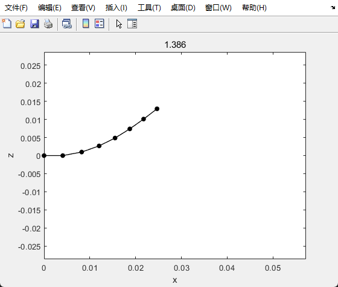

## 磁导丝实时仿真 v1.0

### 程序介绍：

以离散弹性杆为基础模型的磁导丝实时仿真程序

|—`main.m` //仿真主程序

|—|—`lump_force`//计算合力，返回加速度

|—|—|—|—`bending_force` //计算弯曲应力

|—|—|—|—`stretching_force ` //计算拉伸应力

|—|—|—|—`damping_force` //计算阻尼力

|—|—|—|—`magnetic_force ` //计算磁驱动力

|—|—|—|—`gravity ` //计算重力

### 参数设置：

需要设置的参数，给出的是推荐值

1. ==NL=7;== 离散边的个数，顶点个数等于该值+1。一般取5-8即可。设置太多的仿真点会增加方程刚性，计算量增加，太少效果不好。
2. ==MASS = 0.06e-03== 导丝的整体质量 （kg)
3. ==LENGTH = 28.6e-03;== 导丝的长度 (m)
4. ==r = (1.086e-03)/2;== 导丝半径 (m)
5. ==Mag = 1e5;== 导丝的磁化强度 (A/m)
6. ==g = 9.81;== 重力加速度 (m/s^2)
7. ==kb = 3e-7;== 弯曲刚度系数，增大使得导丝弯曲变难，但太大会增加方程刚性，计算量增加，减小会使导丝变软。
8. ==kd = 0.1;== 阻尼系数
9. ==ks = 0.01;== 拉伸刚度系数，增大使得导丝难以拉伸，但太大会增加方程刚性，计算量增加，减小导丝展现轴向弹性
10. ==sN=[1,2];==被固定的顶点，范围不能超过离散顶点的总个数，可以任意选取。
11. ==h = 0.001;== 时间步长 积分采用显示欧拉法，需要较低的时间步长。如果方程刚度太大，那么需要降低时间步长。如果一帧的计算时间大于时间步长则无法实现实时仿真。如果仿真结果崩溃了，说明微分方程数值解崩溃，则可以通过降低时间步长的办法拯救。使用隐式欧拉法的积分过程还在开发中。
12. ==tolSimTime=10;== 总仿真时间(s)

### 开始仿真：

1. 设置初始位置和速度：

```matlab
x0 = [linspace(0,LENGTH,NL+1);zeros(1,NL+1);zeros(1,NL+1)]; % |----------
v0 = zeros(3,NL+1);
```

这里设置的是水平放置的初始状态。还可以设置竖直放置的状态，比如：

```matlab
x0 = [zeros(1,NL+1);zeros(1,NL+1)];linspace(0,LENGTH,NL+1) % |----------
```


2. 设置外部磁场大小和方向：（单位为T)

```matlab
Bm = [0;0;10]*1e-3; %external magnetic field
```

时变磁场则需要在循环计算过程中实现，与当前仿真时间simTime配合即可。

3.实时仿真开始：

```MATLAB
while simTime < tolSimTime
    % time-variant 
    % set Bm here
    forces = lump_force(x,v,NL,MASS,LENGTH,r,g,Mag,kb,kd,ks,sN,Bm);
    % 注意这里的力已经除过质量了，是加速度形式！
    newx = x+h*v+h^2*forces;
    % Plot
    v = (newx - x)/h;
    x = newx;
end
```

循环计算每一个时间步长，采用显示欧拉法。

```matlab
    % Plot
    if simTime - lastsimTime > 0.0417 % 伪实时帧率
        lastsimTime = simTime;
        plot(x(1,:),x(3,:),'.-k','MarkerSize',20,'Linewidth',1);
        xlabel('x');ylabel('z');
        xlim([0,2*LENGTH]);ylim([-LENGTH,LENGTH]);
%         xlim([-LENGTH,LENGTH]);ylim([0,LENGTH]);
        title(simTime)
        pause(1e-8);
    end
    simTime = simTime + h;
```

绘图过程，放在Plot位置。0.0417是绘图间隔，帧率为24。

4. 仿真结果：

设置水平放置的磁导丝，施加外部向上的10mT磁场，仿真结果如下：

观察到磁导丝响应非常迅速，如果需要观察更加细致的内容，可以降低时间步长，或者降低两帧图片的显示间隔。